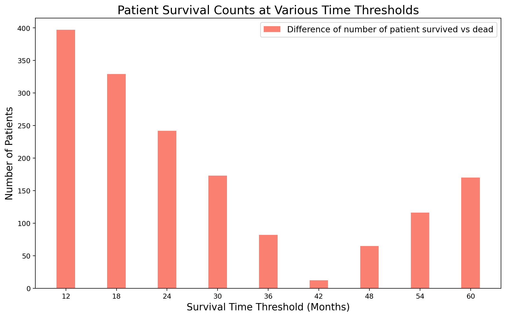
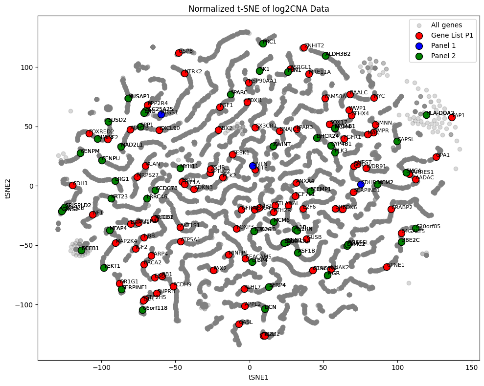
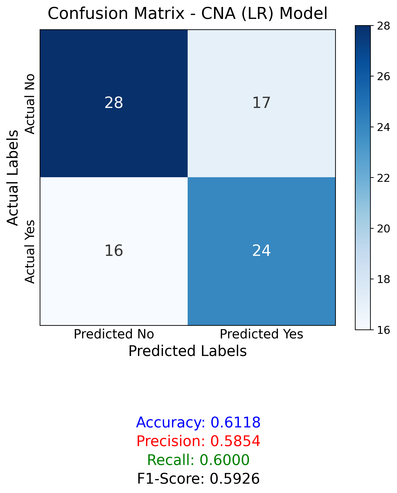
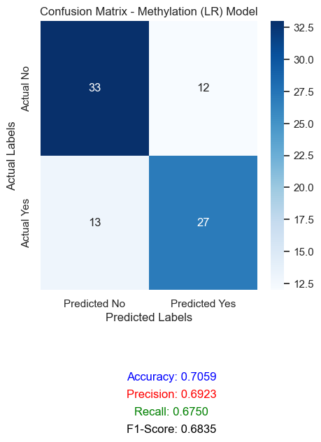
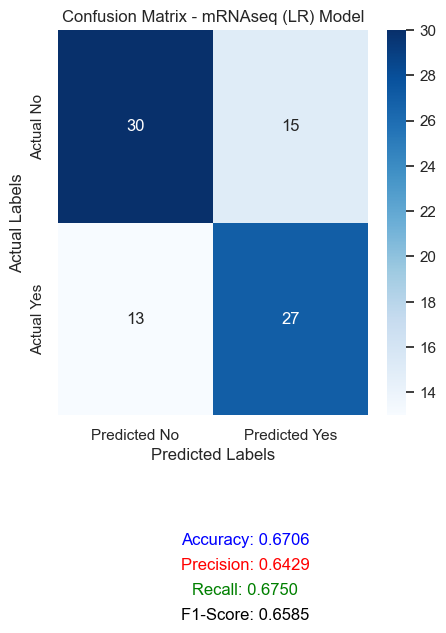
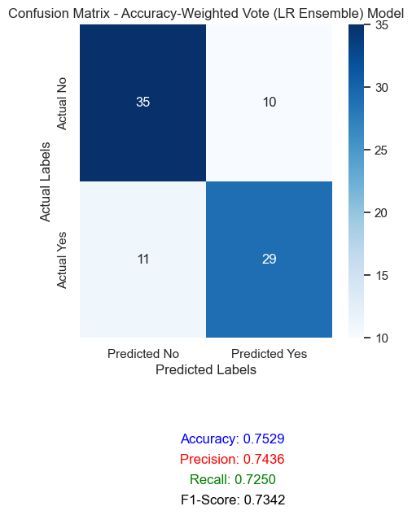
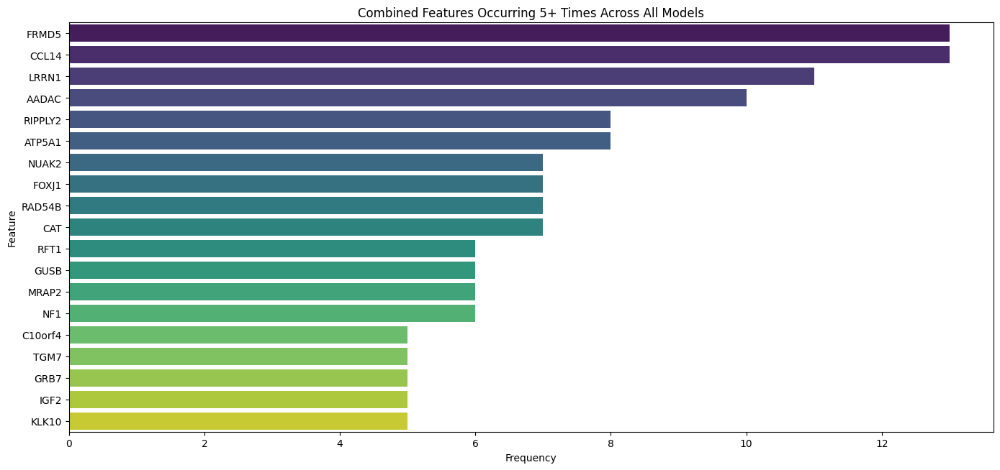

# Interpretable Multi-Omics Ovarian Cancer Survival Prediction

This repository presents an interpretable machine-learning project for **epithelial ovarian cancer survival prediction** using multi-omics data. The project combines **mRNA-seq**, **DNA methylation**, and **log2 copy-number alteration (log2CNA)** features with explainable AI outputs to identify genes/features that repeatedly influenced survival-classification decisions.

The biological framing of this project is guided by two main literature sources:

1. **Millstein et al., “Prognostic gene expression signature for high-grade serous ovarian cancer,” Annals of Oncology, 2020** — the source of the 101-gene high-grade serous ovarian cancer prognostic reference panel used in this project. The paper measured 513 genes in 3,769 HGSOC tumors, trained a prognostic model on 2,702 tumors, validated it on 1,067 tumors, and reported a 101-gene signature associated with overall survival. [1]
2. **Srinivasamurthy and Ramamoorthi, “The Progression and Prospects of the Gene Expression Profiling in Ovarian Epithelial Cancer,” Gynecology and Minimally Invasive Therapy, 2024** — used as background support for the importance of gene-expression profiling and gene signatures in ovarian epithelial cancer research. [2]

This project is **research-oriented** and should be interpreted as a computational and biological exploration, not as a clinically validated diagnostic or prognostic tool.

---

## Executive Summary

The project predicts binary survival outcomes in epithelial ovarian cancer using high-dimensional multi-omics data. The main objective is not only to improve prediction accuracy, but also to make the model interpretable by identifying the genes and molecular features that influence its decisions.

The final modeling strategy uses separate **L1-regularized Logistic Regression** models for CNA, methylation, and mRNA-seq data. L1 regularization was selected because it performs classification while also shrinking weak feature coefficients to zero, making the model useful for sparse gene-level interpretation. The outputs from the three omics-specific models were combined using an **accuracy-weighted ensemble voting** strategy.

Explainability was performed using SHAP-based feature attribution on the trained Logistic Regression models. SHAP assigns feature-level contribution values to model predictions, making it useful for connecting model decisions back to specific genes/features. [3]

The biological interpretation focuses on ovarian-cancer-relevant processes such as epithelial identity, tumor plasticity, cell-cycle dysregulation, DNA repair, immune response, stromal signaling, angiogenesis, metabolic stress, and treatment resistance.

---

## Motivation

Ovarian cancer is frequently diagnosed at an advanced stage and has poor long-term survival. High-grade serous ovarian cancer, the most lethal epithelial ovarian cancer subtype, is responsible for a large fraction of ovarian cancer deaths and is characterized by extensive genomic instability and clinical heterogeneity. [1,4]

Survival prediction in ovarian cancer is challenging because tumor behavior is shaped by multiple biological layers. Gene expression, DNA methylation, and copy-number alteration each capture different aspects of tumor biology. A multi-omics approach can therefore provide a broader view than a single data type.

However, multi-omics datasets are usually extremely high dimensional: the number of molecular features is much larger than the number of patients. This makes interpretability essential. A black-box model may produce predictions, but it does not easily explain which genes or biological pathways drove those predictions.

This project addresses that problem by combining:

- multi-omics survival classification,
- sparse interpretable modeling,
- literature-guided gene filtering,
- ensemble prediction,
- and explainable AI gene-level interpretation.

---

## Dataset and Multi-Omics Inputs

The project uses three processed omics layers:

| Omics layer | Patients | Features | Feature meaning |
|---|---:|---:|---|
| DNA methylation | 418 | 22,600 | CpG/methylation sites linked to gene regulation |
| mRNA-seq | 218 | 19,076 | Gene-expression features |
| log2CNA | 417 | 25,128 | Gene-level copy-number alteration features |

Patient overlap across the omics layers was limited. The project files report that 417 patients have both methylation and log2CNA data, while 213 patients have all three datasets: methylation, mRNA-seq, and log2CNA.

The survival target was converted into a binary classification label using month-level survival thresholds. The project tested multiple thresholds and selected the threshold that produced the most balanced survived-vs-deceased split.

<p align="center">
  
</p>

**Figure 1. Survival-threshold class-balance analysis.**  
The difference between survived and deceased patient counts was smallest around the **42-month survival threshold**, so 42 months was selected as the binary survival cutoff for the main modeling experiment.

---

## Exploratory Biological Check: Literature Gene Overlay on CNA Space

A t-SNE visualization was generated for normalized log2CNA features, and literature-derived ovarian cancer gene panels were overlaid on the broader CNA feature space.

<p align="center">
  
</p>

**Figure 2. Normalized t-SNE of log2CNA data with literature-derived epithelial ovarian cancer gene panels overlaid.**  
Grey points represent all CNA genes/features. Colored points represent genes from literature-derived ovarian cancer panels. This plot was used as an exploratory sanity check to confirm that literature-supported ovarian cancer genes were present within the processed CNA feature space. It should not be interpreted as proof of survival causality, because t-SNE is primarily a visualization method.

---

## Modeling Workflow

The project workflow follows this structure:

1. Load processed mRNA-seq, methylation, and log2CNA datasets.
2. Align patients across datasets using Sample ID.
3. Remove samples with missing survival labels for the selected threshold.
4. Normalize the omics matrices.
5. Remove low-variance features.
6. Rank remaining features using Pearson correlation with the survival label.
7. Retain a top percentage of informative features.
8. Add back literature-supported genes from the 101-gene reference panel if they were removed during filtering.
9. Train separate L1 Logistic Regression models for CNA, methylation, and mRNA-seq.
10. Tune regularization strength using GridSearchCV.
11. Evaluate each model using accuracy, precision, recall, F1-score, and confusion matrix.
12. Combine the three model predictions using accuracy-weighted voting.
13. Use SHAP explanations to extract repeatedly important decision-making genes/features.

The project also tested other models, including SVM, Random Forest, Decision Tree, and MLP. The final selected model was L1 Logistic Regression because it produced competitive performance while preserving gene-level interpretability.

---

## Model Performance

### CNA-only L1 Logistic Regression

<p align="center">
  
</p>

**Figure 3. L1 Logistic Regression performance using only log2CNA features.**

| Model | Accuracy | Precision | Recall | F1-score |
|---|---:|---:|---:|---:|
| CNA LR | 0.6118 | 0.5854 | 0.6000 | 0.5926 |

The CNA-only model captured some survival signal, but its performance was modest compared with methylation, mRNA-seq, and the final ensemble.

---

### Methylation-only L1 Logistic Regression

<p align="center">
  
</p>

**Figure 4. L1 Logistic Regression performance using DNA methylation features.**

| Model | Accuracy | Precision | Recall | F1-score |
|---|---:|---:|---:|---:|
| Methylation LR | 0.7059 | 0.6923 | 0.6750 | 0.6835 |

The methylation model performed strongly as a single-omics model, with better accuracy and precision than the CNA-only model.

---

### mRNA-seq-only L1 Logistic Regression

<p align="center">
  
</p>

**Figure 5. L1 Logistic Regression performance using mRNA-seq features.**

| Model | Accuracy | Precision | Recall | F1-score |
|---|---:|---:|---:|---:|
| mRNA-seq LR | 0.6706 | 0.6429 | 0.6750 | 0.6585 |

The mRNA-seq model showed meaningful survival-prediction signal, with recall comparable to methylation but lower precision and accuracy in this result set.

---

### Accuracy-Weighted Ensemble Model

<p align="center">
  
</p>

**Figure 6. Accuracy-weighted ensemble voting across CNA, methylation, and mRNA-seq L1 Logistic Regression models.**

| Model | Accuracy | Precision | Recall | F1-score |
|---|---:|---:|---:|---:|
| Accuracy-weighted LR ensemble | 0.7529 | 0.7436 | 0.7250 | 0.7342 |

The accuracy-weighted ensemble produced the strongest reported result. It improved accuracy, precision, recall, and F1-score compared with each individual omics model.

---

## Explainable AI Results: Top Decision-Making Genes

The final explainability output aggregated genes/features that repeatedly appeared as important decision-making features across the L1 Logistic Regression models.
<p align="center">
  
</p>

**Figure 7. Most common decision-making genes across the L1 Logistic Regression models.**  
Genes appearing more frequently were selected more often as important contributors to model decisions. This plot should be interpreted as model-level feature importance, not as proof that these genes are causal drivers of survival.

### Selection-Frequency Ranges

| Frequency range | Genes |
|---|---|
| `> 40 times` | TWIST1 |
| `30–40 times` | LIPC, SYNE2 |
| `20–30 times` | TOMM40L, APPL2, AGMAT |
| `10–20 times` | CDC20, HIST2H2AB, MPHOSPH10, ALS2CL, UHMK1, ZNF436, SFXN5, TSPYL5, CDK2, PNMA3, KCNS3, ATP6V1D, EIF2S1, SERPINC1, IL1RAPL1, CDC37, PADI6 |
| `≥ 9 times` | CLEC4A, LINC01799, TXNDC12, PHTF1, B3GALT2, CELSR3, ABHD6 |

---

## Literature-Derived 101-Gene Panel

The 101-gene panel was used as a **biologically informed reference set**, not as a result invented by this project. It comes from Millstein et al., who developed a 101-gene prognostic expression signature for high-grade serous ovarian cancer overall survival. [1]

This README does **not** explain every gene in the 101-gene panel individually. The role of the panel here is to provide a literature-supported comparator for the project’s model-identified explainable features.

### Complete 101-Gene Panel Used as Reference

```text
CDH1, STK16, MAL, GJB1, TESK1, PTH2R, DNAJC9, SRI, WWP1, AKT1S1,
MYOD1, NF1, CPNE1, BNIP3L, NUCB2, AADAC, MITF, CEACAM5, GMNN, ATP5A1,
C19orf12, BRCA2, GMPR, SMARCA4, PCDH9, MAK, PCK2, GFRA1, BAALC, RNASEL,
B4GALT5, MYC, LPAR3, DUSP4, CDKN3, E2F6, FAM58A, PARP4, KRT6, FOXJ1,
HSP90AA1, USP8, HIF1A, SMO, CTLA4, CCNE1, ASRGL1, FGFR1, IL22, PPP2R4,
ZFHX4, SPTLC2, PD.1, FOXP3, RB1, CXCL10, PAX2, OPA1, EZR, OASL,
RARRES1, ANXA4, HBB, SERPINE1, MINPP1, APPL2, MRPS27, MDM2, CDK6,
CRABP2, SHPRH, WDR91, NTRK2, GUSB, OR1G1, TAP1, ESR2, IGHM, CX3CR1,
MRE11A, VCAN, GTF2H5, MEST, IGF2, KDM5D, TCF7L1, VSIG4, NF2, FOXRED2,
MAP2K4, ADH1B, TBX2, NUAK2, ESD, FGF1, ZNHIT2, PGRA, KLHL7, SOX17,
TSHR, CXCL9
```

**Notation notes:**

- `PD.1` is commonly represented by the gene symbol **PDCD1** when referring to the PD-1 immune checkpoint receptor.
- `PGRA` appears in the project gene list. If this refers to progesterone receptor A, the canonical gene symbol is usually **PGR**, with PR-A referring to an isoform/protein notation. This should be verified against the original annotation file before publication.
- `SERPINC1` from the XAI plot is **not** the same gene as `SERPINE1` from the 101-gene panel.
- `CDK2` from the XAI plot is **not** the same gene as `CDK6` from the 101-gene panel.

---

## Overlap Between Literature-Derived Genes and XAI Top Features

The visible XAI gene list was compared with the 101-gene reference panel.

### Exact Overlap

The exact overlap is:

```text
APPL2
```

| Gene | Description | What the gene does | Relevance to ovarian cancer |
|---|---|---|---|
| APPL2 | APPL2 appeared in both the 101-gene literature-derived panel and the project’s top XAI feature list. | APPL2 encodes an adaptor protein associated with Rab5/endosomal signaling and can participate in signal-transduction pathways. [5] | Its ovarian-cancer relevance in this README is based on its inclusion in the Millstein et al. HGSOC 101-gene prognostic signature, not on a separately validated APPL2-specific ovarian cancer mechanism in this project. [1] |

This overlap matters because it shows that at least one model-prioritized feature was also present in a large externally derived HGSOC prognostic gene signature. The overlap does not prove causality, but it strengthens the biological interpretability of the model output.

---

## Additional XAI Genes with Ovarian-Cancer-Relevant Literature Support

The genes below were present in the model’s explainable AI top-feature plot and have ovarian-cancer-relevant literature support. Genes without direct or well-supported ovarian cancer relevance are not interpreted in detail.

| Gene | Description | What the gene does | Relevance to ovarian cancer |
|---|---|---|---|
| TWIST1 | Most frequent XAI decision-making gene in the project. | TWIST1 is a basic helix-loop-helix transcription factor associated with epithelial-to-mesenchymal transition, invasion, and metastatic behavior. [6] | TWIST expression has been reported as a predictor of unfavorable prognosis in ovarian epithelial cancers, and TWIST1 has also been linked to cisplatin resistance and survival in epithelial ovarian cancer models. [6,7] |
| LIPC | High-frequency XAI gene in the 30–40 selection-frequency range. | LIPC encodes hepatic lipase and is involved in lipid metabolism. | In patient-derived epithelial ovarian cancer tumor organoids, LIPC was reported among top upregulated genes in carboplatin-resistant tumor organoids. This supports cautious interpretation of LIPC as a candidate metabolism/therapy-response-associated signal, not as a validated survival biomarker. [8] |
| CDC20 | XAI gene in the 10–20 selection-frequency range. | CDC20 regulates mitotic progression through the anaphase-promoting complex/cyclosome and is linked to cell-cycle progression. | CDC20 has been reported as a biomarker for improved clinical prediction in epithelial ovarian cancer, with high CDC20 expression associated with poor prognosis. [9] |
| TSPYL5 | XAI gene in the 10–20 selection-frequency range. | TSPYL5 has been described as a tumor-suppressor-related gene in multiple cancer contexts. | In an ovarian cancer study, miR-629 upregulation was associated with reduced TSPYL5 expression in ovarian cancer tissue, and the miR-629/TSPYL5 axis was linked to malignant ovarian cancer cell behaviors. [10] |
| CDK2 | XAI gene in the 10–20 selection-frequency range. | CDK2 is a cyclin-dependent kinase that regulates G1/S cell-cycle progression. | CDK2 is biologically relevant to ovarian cancer through the CCNE1/CDK2 axis. Ovarian cancer cells with elevated CCNE1 expression have been reported to be more sensitive to CDK2 inhibition, and CCNE1-amplified high-grade serous ovarian cancer has been studied as a targetable subgroup. [11,12] |
| ATP6V1D | XAI gene in the 10–20 selection-frequency range. | ATP6V1D encodes a component of the vacuolar ATPase complex, which participates in proton transport and cellular/organelle acidification. | In ovarian cancer cell-line experiments, combined metformin and simvastatin treatment downregulated ATP6V1D and affected AMPK/mTOR-related pathways, supporting ATP6V1D as a candidate metabolism/signaling-related feature in ovarian cancer cells. [13] |
| SERPINC1 | XAI gene in the 10–20 selection-frequency range. | SERPINC1 encodes antithrombin, a serine protease inhibitor involved in coagulation regulation. [14] | Circulating exosomal SERPINC1 has been reported as upregulated in epithelial ovarian cancer and proposed as a diagnostic biomarker candidate. This supports ovarian-cancer relevance, but not direct survival causality in this project. [15] |
| CDC37 | XAI gene in the 10–20 selection-frequency range. | CDC37 is an HSP90 co-chaperone that stabilizes kinase client proteins and supports kinase signaling. [16] | An ovarian cancer network-pharmacology and experimental study reported CDC37 as a direct celastrol-interacting target in ovarian cancer and connected it to ovarian cancer cell proliferation/cell-cycle effects. [17] |
| LINC01799 | XAI gene in the ≥9 selection-frequency range. | LINC01799 is a long intergenic non-coding RNA. | LINC01799 has been included in an m6A-related long-noncoding-RNA prognostic signature for ovarian cancer. This supports possible prognostic relevance but requires further validation in this project’s cohort. [18] |
| B3GALT2 | XAI gene in the ≥9 selection-frequency range. | B3GALT2 is a glycosyltransferase involved in glycan biosynthesis. | O-glycan pathway expression has been associated with in vitro gemcitabine sensitivity and overall survival from ovarian cancer, and B3GALT2 appears in this pathway context. This supports cautious interpretation as a glycosylation-related candidate feature. [19] |

---

## Biological Interpretation

The explainability results suggest several candidate biological axes for further validation.

### 1. Tumor plasticity and epithelial-mesenchymal transition

TWIST1 was the most frequently selected XAI gene. Because TWIST1 is linked to epithelial-to-mesenchymal transition and unfavorable prognosis in ovarian epithelial cancer, its high feature frequency suggests that the model may be capturing tumor plasticity and invasion-related survival signals. [6]

### 2. Cell-cycle dysregulation and proliferation

CDC20 and CDK2 both appeared among the XAI top features. CDC20 is tied to mitotic progression, while CDK2 is central to G1/S transition and the CCNE1/CDK2 axis. These signals are consistent with cell-cycle acceleration and proliferation as relevant biological dimensions in epithelial ovarian cancer survival prediction. [9,11,12]

### 3. Treatment response and resistance-associated biology

TWIST1 has literature support in cisplatin resistance, LIPC was observed in carboplatin-resistant epithelial ovarian cancer organoids, and CDK2 is tied to CCNE1-driven ovarian cancer biology. These findings suggest that some model-selected genes may relate to treatment-response biology, but this project does not validate treatment response directly. [7,8,11,12]

### 4. Metabolic and stress signaling

ATP6V1D and LIPC connect the model output to metabolic regulation, organelle acidification, mTOR-related signaling, and lipid metabolism. These mechanisms are biologically plausible in ovarian cancer but require independent validation in survival-specific cohorts. [8,13]

### 5. Coagulation and extracellular vesicle biomarker biology

SERPINC1 connects the XAI output to coagulation-related biology and circulating exosomal protein signatures in epithelial ovarian cancer. Its inclusion should be interpreted as a candidate signal rather than a causal survival mechanism. [14,15]

### 6. Non-coding RNA and glycosylation-related signals

LINC01799 and B3GALT2 point toward non-coding RNA regulation and glycosylation pathways. These are biologically relevant areas in ovarian cancer research, but the evidence is less direct than for TWIST1, CDC20, or CDK2. [18,19]

---

## Key Takeaway

The strongest result of this project is not simply the final ensemble accuracy. The stronger contribution is that the model produces interpretable gene-level outputs and allows comparison between:

1. **data-driven model-selected features**, and  
2. **literature-derived ovarian cancer gene signatures**.

The exact overlap between the 101-gene reference panel and the XAI top features was limited to **APPL2**, but several non-overlapping XAI genes, including **TWIST1, CDC20, CDK2, LIPC, ATP6V1D, SERPINC1, TSPYL5, CDC37, LINC01799, and B3GALT2**, have ovarian-cancer-relevant literature support. These genes should be treated as candidate biological signals for further validation.

---

## References

[1] Millstein J, Budden T, Goode EL, et al. **Prognostic gene expression signature for high-grade serous ovarian cancer.** *Annals of Oncology.* 2020;31(9):1240–1250. doi: 10.1016/j.annonc.2020.05.019. PubMed: https://pubmed.ncbi.nlm.nih.gov/32473302/

[2] Srinivasamurthy BC, Ramamoorthi C. **The Progression and Prospects of the Gene Expression Profiling in Ovarian Epithelial Cancer.** *Gynecology and Minimally Invasive Therapy.* 2024. PubMed: https://pubmed.ncbi.nlm.nih.gov/39184260/

[3] Lundberg SM, Lee S-I. **A Unified Approach to Interpreting Model Predictions.** *NeurIPS.* 2017. https://arxiv.org/abs/1705.07874

[4] Cancer Genome Atlas Research Network. **Integrated genomic analyses of ovarian carcinoma.** *Nature.* 2011;474:609–615. doi: 10.1038/nature10166. PubMed: https://pubmed.ncbi.nlm.nih.gov/21720365/

[5] NCBI Gene. **APPL2 adaptor protein, phosphotyrosine interacting with PH domain and leucine zipper 2.** https://www.ncbi.nlm.nih.gov/gene/55198

[6] Kim K, et al. **The Role of TWIST in Ovarian Epithelial Cancers.** *Korean Journal of Pathology.* 2014. PMC: https://pmc.ncbi.nlm.nih.gov/articles/PMC4160591/

[7] Roberts CM, et al. **TWIST1 drives cisplatin resistance and cell survival in an ovarian cancer model.** *Oncotarget.* 2016. PubMed: https://pubmed.ncbi.nlm.nih.gov/27876874/

[8] Gorski JW, et al. **Utilizing Patient-Derived Epithelial Ovarian Cancer Tumor Organoids to Predict Carboplatin Resistance.** *Biomedicines.* 2021;9(8):1021. doi: 10.3390/biomedicines9081021. https://www.mdpi.com/2227-9059/9/8/1021

[9] Xi X, et al. **CDC20 is a novel biomarker for improved clinical predictions in epithelial ovarian cancer.** *American Journal of Cancer Research.* 2022;12(7):3303–3317. PubMed: https://pubmed.ncbi.nlm.nih.gov/35968331/

[10] Shao L, Shen Z, Qian H, Zhou S, Chen Y. **Knockdown of miR-629 inhibits ovarian cancer malignant behaviors by targeting TSPYL5.** *DNA and Cell Biology.* 2017. PubMed: https://pubmed.ncbi.nlm.nih.gov/28972400/

[11] Yang L, Fang D, Chen H, et al. **Cyclin-dependent kinase 2 is an ideal target for ovary tumors with elevated cyclin E1 expression.** *Oncotarget.* 2015;6(25):20801–20812. doi: 10.18632/oncotarget.4600. PMC: https://pmc.ncbi.nlm.nih.gov/articles/PMC4673230/

[12] Au-Yeung G, et al. **Selective targeting of Cyclin E1-amplified high-grade serous ovarian cancer.** *Clinical Cancer Research.* 2017. PMC: https://pmc.ncbi.nlm.nih.gov/articles/PMC5364079/

[13] Mikhael S, et al. **Evaluating synergistic effects of metformin and simvastatin on ovarian cancer cells.** *PLOS ONE.* 2024;19(3):e0298127. doi: 10.1371/journal.pone.0298127. https://journals.plos.org/plosone/article?id=10.1371/journal.pone.0298127

[14] NCBI Gene. **SERPINC1 serpin family C member 1.** https://www.ncbi.nlm.nih.gov/gene/462

[15] Wang S, Wang H, Wang K, Zhang Q, Song X. **Circulating exosomal protein EFEMP1 and SERPINC1 as diagnostic biomarkers for epithelial ovarian cancer.** *Translational Oncology.* 2024;50:102126. PubMed: https://pubmed.ncbi.nlm.nih.gov/39317065/

[16] Gray PJ Jr, Prince T, Cheng J, Stevenson MA, Calderwood SK. **Targeting the oncogene and kinome chaperone CDC37.** *Nature Reviews Cancer.* 2008;8:491–495. doi: 10.1038/nrc2420. https://www.nature.com/articles/nrc2420

[17] Wang X, et al. **Identifying the effect of celastrol against ovarian cancer with network pharmacology and experimental validation.** *Frontiers in Pharmacology.* 2022. PMC: https://pmc.ncbi.nlm.nih.gov/articles/PMC8971755/

[18] Song Y, Qu H. **Identification and validation of a seven m6A-related lncRNAs signature predicting prognosis of ovarian cancer.** *BMC Cancer.* 2022. PMC: https://pmc.ncbi.nlm.nih.gov/articles/PMC9178823/

[19] Bou Zgheib N, et al. **The O-glycan pathway is associated with in vitro sensitivity to gemcitabine and overall survival from ovarian cancer.** *International Journal of Oncology.* 2012;41(1):179–188. PMC: https://pmc.ncbi.nlm.nih.gov/articles/PMC4017641/
